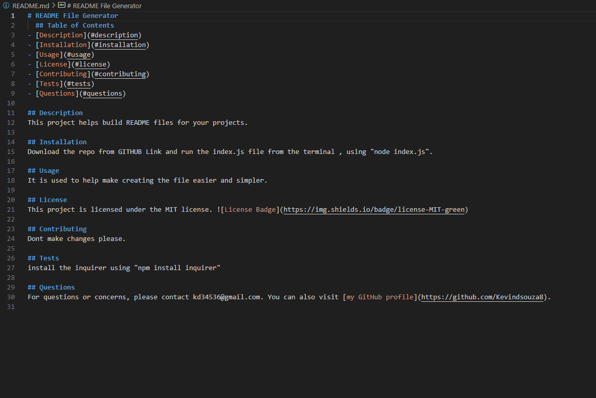

# Project README Generator

## Description
This is a simple command-line application that generates a README file for your project. It uses Node.js and the Inquirer package to prompt the user with a series of questions about their project. The provided answers are then used to dynamically create a professional README file.

## Table of Contents
- [Installation](#installation)
- [Usage](#usage)
- [License](#license)
- [Contributing](#contributing)
- [Tests](#tests)
- [Questions](#questions)
- [Video](#video)

## Installation
To install the necessary dependencies, run the following command:
```bash
npm install
```

## Usage
After installing the dependencies, run the application by executing the following command:
```bash
node index.js
```
Follow the prompts to provide information about your project, and the application will generate a README file named `README.md` in the project directory.

## License
This project is licensed under the [MIT License](LICENSE).

## Contributing
If you want to contribute to this project, please follow the [Contribution Guidelines](CONTRIBUTING.md).

## Tests
To run tests, follow these instructions:
```bash
npm test
```

## Questions
If you have any questions or need further assistance, feel free to contact me:
- **GitHub: [your-username](https://github.com/your-username)**
- **Email: your-email@example.com**

## Video
Watch the video tutorial for using the README Generator:
[](./Assets/video-tutorial.mp4)

---

*This README was generated with ❤️ by Kevin Dsouza.